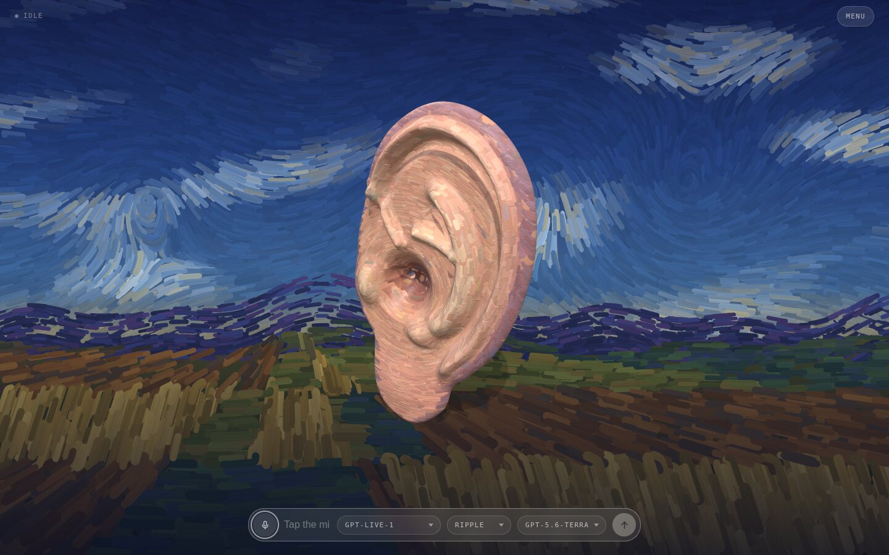
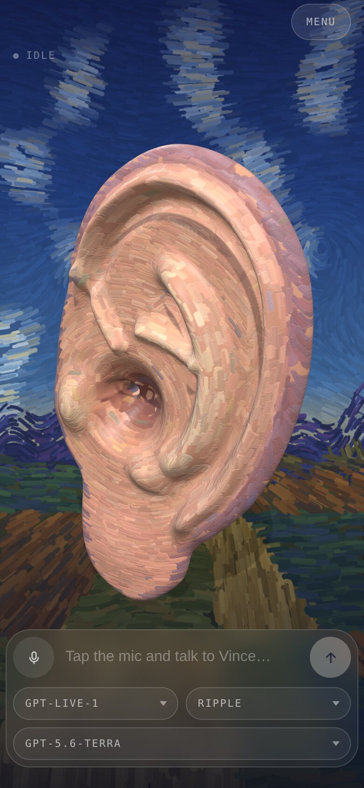

# Vince

A voice agent rendered as a disembodied ear — the one that went missing in Arles.
Vince is painted on in thick, loaded strokes that follow his folds, and he stands
on his lobe in front of an evening landscape painted the same way. He turns to
face you while you talk, cocks to one side and swirls while he thinks, and hops
in time with his own voice — all of it driven by a live OpenAI GPT-Live
conversation, with a Responses backend for reasoning and tools. He is an artist,
an empath, and much happier listening than talking. He remembers what you tell
him to, between calls.



<p align="center">
  
</p>

## Run

```sh
git clone https://github.com/h1ddenpr0cess20/vince
cd vince
npm install
cp .env.example .env      # add your OPENAI_API_KEY
npm run dev               # → http://localhost:5173
```

Requires API access to `gpt-live-1` and to the backend model (`gpt-5.6-terra`
by default). Voice duration, backend tokens and tool use are billed separately.

Click the mic, allow the browser's microphone prompt, and start talking.

Three pickers sit under the composer: the GPT-Live model that does the talking,
the voice it talks in, and the Responses model behind it that reasons, looks
things up and runs the tools. Changing any of them redials and keeps the
conversation.

Tapping the mic is the microphone switch: turning it off stops what you send and
leaves the answer playing, and the conversation is still there when you turn it
back on. It also switches itself off after a minute of silence, and the call
survives that too. Holding the mic down is the hang-up — a ring closes around it
while you hold, and the call ends when it lands.

`menu`, in the top corner, is where the panels live: `tools`, `connectors`,
`memory` and the log, one row each. Picking a row closes the menu behind it,
and work still running says so on the button while the menu is shut.

`tools` includes web search, on by default. Ask Vince about something current and
the backend can go and look while he keeps talking. What it read appears as
clickable links under the caption, and goes when the caption does. Switching
search off reconnects the call.

`connectors` is where you hand Vince a coding agent. Switch on Codex, point it at
a repo, and say what you want built: Vince dispatches it, and tells you when it
lands. The agent runs headless on the machine serving the page and edits real
files, so nothing is on until you turn it on — see
[configuration](docs/configuration.md#connectors).

The log keeps every conversation. `continue` on one picks it back up: the call is
dialled again with those turns handed over as context, and what you say from
there lands in the same entry rather than a new one.

| Script | |
|---|---|
| `npm run dev` | Vite, with the proxy mounted as middleware — one process |
| `npm run dev:lan` | The same, over HTTPS on the network — for a phone |
| `npm run build` | Bundles the client to `dist/` |
| `npm start` | Serves `dist/` with the same proxy in front |
| `npm run preview` | `build` then `start` |
| `npm run preview:lan` | `build` then `start`, over HTTPS on the network |
| `npm test` | `node:test` over the client and server |
| `npm run lint` | ESLint |

CI runs the lint, the tests on Node 22.12 and 24, and a build that then has to
boot and serve itself over both HTTP and HTTPS. CodeQL scans the same source on
every push and again weekly, since its queries change faster than this does.

To run it on a phone, or in Docker, see
[configuration](docs/configuration.md#on-a-phone).

## Docs

- [**Configuration**](docs/configuration.md) — every environment variable, the
  voice picker, the HTTPS setup a phone needs for microphone access, and Docker.
- [**Design notes**](docs/design.md) — how the call is wired, what's in
  `localStorage`, the moods, how the ear and the paintings are made, the source
  layout, and the seam another provider would have to implement.
- [**AI Output Disclaimer**](docs/ai-output-disclaimer.md) — what the model says
  is the model's, not the author's, plus the risks that are specific to a live
  microphone and speech you hear before anyone can check it.
- [**Not a Companion**](docs/not-a-companion.md) — Vince is a toy and a demo.
  He is written to listen well, and he is still not a friend, a therapist, or a
  partner, and the project will not grow in that direction.
